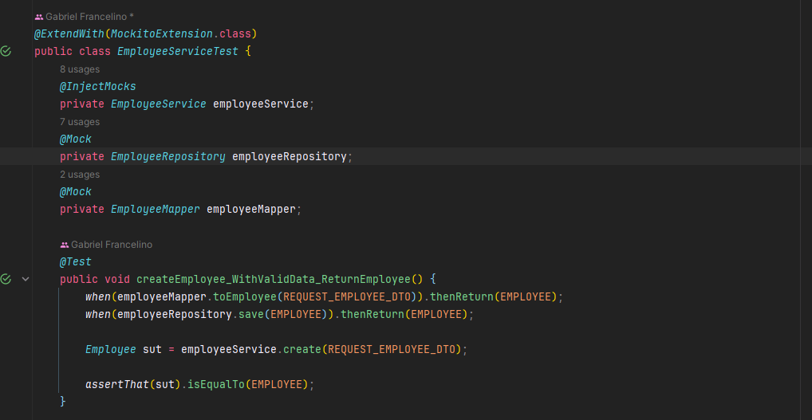

# Employees Spring Boot Restful API

Repositório criando com o intuito de praticar e aprofundar alguns conceitos de Spring Boot, ele foi inspirado no guia [Building REST services with Spring](https://spring.io/guides/tutorials/rest/).

## Tecnologias

## Conteúdos estudados

Aqui está a descrição atualizada das tecnologias utilizadas no projeto Spring Boot:

- **H2 Database**: O H2 é um banco de dados relacional em memória escrito em Java. É frequentemente utilizado em desenvolvimento e teste de aplicativos devido à sua leveza, simplicidade de configuração e facilidade de uso.

- **JPA/Hibernate**: Java Persistence API (JPA) é uma especificação do Java que facilita o mapeamento de objetos Java para tabelas de banco de dados. O Hibernate é uma das implementações mais populares da JPA, oferecendo recursos adicionais e simplificando o acesso a bancos de dados relacionais.

- **Lombok**: Lombok é uma biblioteca Java que reduz a quantidade de código boilerplate necessário para criar classes Java, gerando automaticamente métodos getters, setters, construtores e muito mais.

- **HATEOAS**: HATEOAS (Hypermedia as the Engine of Application State) é um princípio de arquitetura para projetar APIs RESTful. Ele permite que os clientes descubram dinamicamente os recursos disponíveis em um serviço web, melhorando a navegabilidade e a interoperabilidade entre sistemas.

- **Tratamento de exceções customizadas**: O tratamento de exceções é uma prática essencial no desenvolvimento de software para lidar com situações inesperadas ou erros durante a execução do programa. Um bom tratamento de exceções melhora a robustez e a confiabilidade do aplicativo.

- **Testes de unidade**: Os testes de unidade são uma prática de desenvolvimento de software em que componentes individuais do código são testados isoladamente para garantir seu funcionamento correto. Eles ajudam a detectar e corrigir bugs precocemente no ciclo de desenvolvimento, garantindo a qualidade do código.

- **DTOs**: Data Transfer Objects (DTOs) são objetos utilizados para transferir dados entre subsistemas de um aplicativo. Eles encapsulam os dados necessários para uma operação específica e são frequentemente usados em serviços web para representar os dados transmitidos entre o cliente e o servidor.

- **Documentação com Swagger (Ainda não implementado)**: O Swagger é uma ferramenta de código aberto para a documentação de APIs RESTful. Ele permite que os desenvolvedores descrevam, documentem e testem APIs de forma fácil e eficiente. A documentação gerada pelo Swagger pode ser usada para facilitar a integração com a API e melhorar a comunicação entre equipes de desenvolvimento e clientes. Sua implementação está prevista para fornecer uma documentação clara e completa da API desenvolvida.
